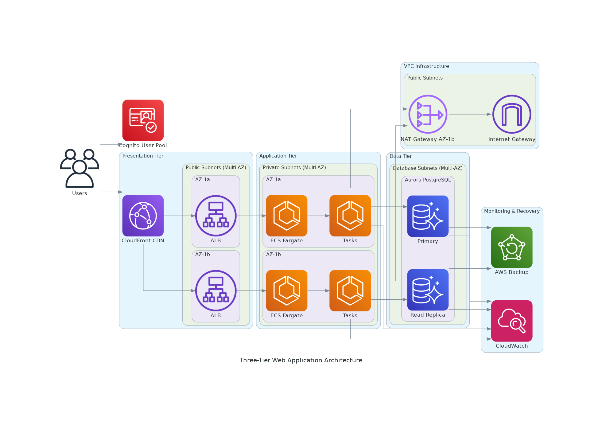

## 3 계층 웹 어플리케이션 아키텍처

By kiro-cli



##### Prompt
```
Create a diagram for a three-tier web application with a presentation tier (ALB and CloudFront), application tier (ECS with Fargate), and data tier (Aurora PostgreSQL). Include VPC with public and private subnets across multiple AZs. Also include NAT gateway and Cognito where it is necessary. Also add monitoring and recovery solution. When you create the diagram, check for AWS documentation to ensure it adheres to AWS best practices before you create the diagram, but with a horizontal view and skip the security group icon. After you generated the image, tell me the file name and its location.
```

##### Pricing
###### NAT Gateway
https://aws.amazon.com/vpc/pricing/
```
Price per NAT gateway ($/hour)	: $0.059	
Price per GB data processed ($) : $0.059
```
2026/02/23 기준 환율로 시간당 86원

##### Fargate
https://aws.amazon.com/fargate/pricing/
```
[Linux/ARM 의 경우]
per vCPU per hour	$0.03725
per GB per hour	    $0.00409

[Linux/ARM Spot 인 경우]
per ARM vCPU per hour	$0.01353007
per ARM GB per hour	$0.00148756
```
2026/02/23 기준 환율로 시간당 53원~
2026/02/23 기준 환율로 시간당 19원~

##### AWS Backup
https://aws.amazon.com/backup/pricing/
```
Amazon RDS Database Snapshot	$0.095 per GB-Month	n/a*	n/a†††	n/a†††
```
2026/02/23 기준 환율로 1GB 당 월 137.56원

##### ALB
https://aws.amazon.com/elasticloadbalancing/pricing/
```
AWS Free Tier
Get started with Elastic Load Balancing for free with the AWS Free Tier. Upon sign-up, new AWS customers receive 750 hours per month shared between Classic and Application load balancers; 15 GB of data processing for Classic load balancers; and 15 LCUs for Application Load Balancers.
```

##### Cognito
https://aws.amazon.com/cognito/pricing/
```
Free Tier
Amazon Cognito Essentials and Lite have a free tier.
```

##### RDS
https://aws.amazon.com/rds/pricing/?refid=ft_rds
```
If you sign up for AWS Free Tier after July 15, 2025, you can choose between a Free Plan or a Paid Plan for access to RDS. Either plan will offer $100 in credits and up to an additional $100 in credits for activating foundational AWS services. Free Tier credits are valid for up to 12 months.
```

##### CloudWatch
https://aws.amazon.com/cloudwatch/pricing/
```
Free tier
You can get started with Amazon CloudWatch for free. Most AWS Services (EC2, S3, Kinesis, etc.) send metrics automatically for free to CloudWatch. Many applications should be able to operate within these free tier limits.
```